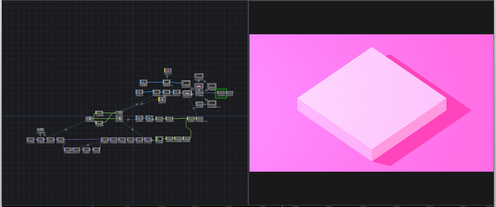
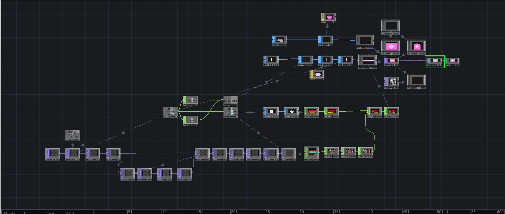

# ASSIGNMENT6
# Project Reflection

## Overview
For this project, I followed the tutorial titled *"[Instancing Geometry - Mouse Interactive - TouchDesigner](https://derivative.ca/community-post/tutorial/instancing-geometry-mouse-interactive-touchdesigner)"* by Noto The Talking Ball. This tutorial provided step-by-step guidance on creating an interactive visual composition using instancing techniques, allowing for dynamic manipulation of geometry with mouse input.

## Process and Modifications
  
  

While adhering to the tutorial’s foundation, I introduced several modifications to make the project uniquely my own. Specifically:  
- I adjusted some aspect's **radius** and **constant parameters** to refine the distribution and behavior of the instanced geometry.  
- I customized the **material colors/ attributes** to enhance the visual aesthetic and align with my artistic vision.  
- I incorporated **new assets**, further personalizing the final composition.  

## Lessons Learned
This project provided an invaluable learning experience in both technical execution and artistic customization. One of the most significant lessons was understanding the importance of instancing and how it can be used to generate complex visual structures efficiently. By adjusting parameters such as radius, scale, and distribution, I gained insight into how TouchDesigner processes data to create dynamic compositions.

Additionally, the experience emphasized the importance of interactive design. By linking mouse input to visual elements, I was able to explore how user engagement can influence digital artwork. This opened my eyes to new creative possibilities, particularly in fields like interactive installations and live performances.

Another key takeaway was the impact of color theory and material selection in digital art. Experimenting with different textures and shades helped me appreciate how subtle changes can dramatically alter the mood and perception of a piece.

Overall, this assignment deepened my understanding of real-time generative visuals, inspiring me to continue experimenting with TouchDesigner and explore how technology can merge with artistic expression.

## Sources
- **Tutorial**: [Instancing Geometry - Mouse Interactive - TouchDesigner](https://derivative.ca/community-post/tutorial/instancing-geometry-mouse-interactive-touchdesigner) by Paketa12  
- **Video Tutorial**: [YouTube Link](https://www.youtube.com/watch?v=SJZIMGg-thY)  

## Final Video
- **Assignment 6**: *[Watch Here](https://www.youtube.com/watch?v=s-_xYhPwmxI)*  
